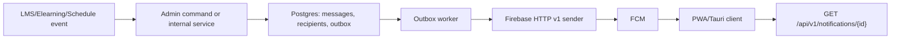

# Tài liệu API - Firebase Push Notification BE

Ngày cập nhật: 2026-06-10, Asia/Saigon  
Phạm vi: `D:\ERG\erg-spring`  
Mục tiêu: làm contract API rõ ràng cho FE web, mobile PWA, và đường fork Tauri sau này.

## 1. Tóm tắt

BE dùng PostgreSQL làm source of truth cho inbox, device registry, outbox, retry và audit. Firebase Cloud Messaging (FCM) chỉ là transport layer để đẩy thông báo tới thiết bị.

Ba nhóm API chính:

- Self notification API: người dùng đọc inbox của chính mình.
- Device API: đăng ký / heartbeat / hủy đăng ký thiết bị nhận push.
- Admin API: tạo notification, broadcast theo user/topic, xem stats và chạy outbox thủ công.

Luồng chuẩn:



## 2. Quy ước chung

### 2.1 Auth

- Tất cả route notification đều cần auth hiện tại của hệ thống.
- Self API và device API chỉ cần authenticated user.
- Admin API cần thêm quyền `notifications.manage`.
- Portal phải nằm trong session của principal; nếu principal có `*` thì được phép mọi portal.

### 2.2 Portal

- `portal` mặc định là `lms` ở các API self khi không truyền vào.
- Portal được normalize sang lowercase và trim.
- Self API không cho đọc qua portal khác session.
- Admin API hiện bị chặn nếu session không ở portal `admin`.

### 2.3 Request ID

Mọi response đều trả qua envelope `ApiResponse`.

```json
{
  "statusCode": 200,
  "message": "Notifications loaded",
  "data": {},
  "errors": null,
  "timestamp": "2026-06-10T12:00:00+07:00",
  "path": "/api/v1/notifications",
  "request_id": "req-123"
}
```

`request_id` lấy từ `request` attribute nếu có, fallback sang header `X-Request-ID`.

### 2.4 Paging

`PageResponse<T>`:

```json
{
  "items": [],
  "page": 0,
  "size": 20,
  "totalItems": 0,
  "totalPages": 0,
  "hasNext": false,
  "hasPrevious": false
}
```

Giới hạn:

- `page`: clamp từ `0` đến `10000`
- `size`: clamp từ `1` đến `100`

### 2.5 Error

Các lỗi chính:

- `401`: thiếu auth
- `403`: portal không hợp lệ hoặc thiếu quyền
- `404`: không tìm thấy notification/device thuộc owner hợp lệ
- `400`: thiếu field, topic invalid, data key bị cấm, payload không hợp lệ

## 3. Self Notification API

Base path: `/api/v1/notifications`

### 3.1 Danh sách inbox

`GET /api/v1/notifications`

Query:

- `portal` optional, default `lms`
- `status` optional: `all | unread | read`
- `page` default `0`
- `size` default `20`

Response data: `PageResponse<NotificationItemResponse>`

`NotificationItemResponse`:

```json
{
  "id": "notification-id-or-recipient-id",
  "recipientId": "recipient-id",
  "eventType": "ASSIGNMENT_CREATED",
  "sourceType": "assignment",
  "sourceId": "asg-1",
  "title": "Bài tập mới",
  "bodyPreview": "Bạn có bài tập mới.",
  "actionUrl": "/lms/assignments/asg-1",
  "priority": "normal",
  "channel": "push",
  "status": "unread",
  "readAt": null,
  "createdAt": "2026-06-10T09:00:00+07:00",
  "data": {
    "kind": "assignment"
  }
}
```

### 3.2 Số lượng chưa đọc

`GET /api/v1/notifications/unread-count?portal=lms`

Response data:

```json
{ "unread": 12 }
```

### 3.3 Chi tiết notification

`GET /api/v1/notifications/{id}?portal=lms`

`id` có thể là:

- recipient id
- notification id

### 3.4 Đánh dấu tất cả đã đọc

`PATCH /api/v1/notifications/read-all?portal=lms`

Response data:

```json
{ "read": true, "updated": 18 }
```

### 3.5 Đánh dấu một item đã đọc

`PATCH /api/v1/notifications/{id}/read?portal=lms`

Response data:

```json
{ "read": true, "updated": 1 }
```

### 3.6 Archive mềm

`DELETE /api/v1/notifications/{id}?portal=lms`

Lưu ý: đây là soft archive, không xóa hard record.

Response data:

```json
{ "archived": true }
```

### 3.7 Preferences

`GET /api/v1/notifications/preferences?portal=lms`

Response data: mảng `NotificationPreferenceResponse`

```json
[
  {
    "eventType": "ASSIGNMENT_CREATED",
    "pushEnabled": true,
    "inboxEnabled": true,
    "emailEnabled": false,
    "quietHours": {
      "start": "22:00",
      "end": "06:00"
    }
  }
]
```

`PUT /api/v1/notifications/preferences`

Body:

```json
{
  "portal": "lms",
  "preferences": [
    {
      "eventType": "ASSIGNMENT_CREATED",
      "pushEnabled": true,
      "inboxEnabled": true,
      "emailEnabled": false,
      "quietHours": {
        "start": "22:00",
        "end": "06:00"
      }
    }
  ]
}
```

Lưu ý:

- Đây là upsert theo `tenantId + userId + portal + eventType`
- Server trả lại toàn bộ list preferences sau khi cập nhật

## 4. Device API

Base path: `/api/v1/notification-devices`

### 4.1 Register device

`POST /api/v1/notification-devices`

Body:

```json
{
  "portal": "lms",
  "platform": "web_pwa",
  "firebaseInstallationId": "fid-123",
  "registrationToken": "compat-token-123",
  "endpoint": "optional",
  "serviceWorkerScope": "/",
  "permissionState": "granted",
  "locale": "vi-VN",
  "timezone": "Asia/Saigon",
  "client": {
    "browserName": "Chrome",
    "browserVersion": "126",
    "osName": "Android",
    "userAgent": "Mozilla/5.0 ..."
  }
}
```

Rule:

- `portal` và `platform` là required
- phải có ít nhất một trong hai: `firebaseInstallationId` hoặc `registrationToken`
- `permissionState` nên là `granted | denied | default`

Response data: `DeviceRegistrationResponse`

```json
{
  "id": "device-id",
  "portal": "lms",
  "platform": "web_pwa",
  "permissionState": "granted",
  "enabled": true,
  "lastSeenAt": "2026-06-10T09:10:00+07:00"
}
```

### 4.2 Unregister device

`POST /api/v1/notification-devices/unregister`

Body:

```json
{
  "portal": "lms",
  "firebaseInstallationId": "fid-123",
  "registrationToken": "compat-token-123"
}
```

Behavior:

- nếu device khớp user/portal hiện tại thì revoke
- nếu không tìm thấy hoặc không khớp owner thì trả success no-op

Response data:

```json
{ "unregistered": true }
```

### 4.3 Heartbeat

`POST /api/v1/notification-devices/heartbeat`

Body:

```json
{
  "portal": "lms",
  "deviceRegistrationId": "device-id",
  "firebaseInstallationId": "fid-123",
  "registrationToken": "compat-token-123",
  "permissionState": "granted"
}
```

Rule:

- phải có ít nhất một trong ba: `deviceRegistrationId`, `firebaseInstallationId`, `registrationToken`
- nếu không tìm thấy device hợp lệ thì trả 404

### 4.4 Revoke own device

`DELETE /api/v1/notification-devices/{deviceId}?portal=lms`

Response data:

```json
{ "revoked": true }
```

## 5. Admin API

Base path: `/api/v1/admin/notifications`

### 5.1 Send / broadcast

`POST /api/v1/admin/notifications/send`

`POST /api/v1/admin/notifications/broadcast`

Hai route map vào cùng một handler.

Body:

```json
{
  "idempotencyKey": "schedule:sch-1:published:v1",
  "eventType": "SCHEDULE_PUBLISHED",
  "sourceType": "schedule",
  "sourceId": "sch-1",
  "title": "Lịch học mới",
  "bodyPreview": "Bạn có lịch học mới.",
  "actionUrl": "/lms/schedule",
  "priority": "normal",
  "portal": "lms",
  "userIds": ["teacher-1"],
  "topicName": "t_erg_portal_lms",
  "data": {
    "kind": "schedule"
  }
}
```

Rule:

- phải có ít nhất một trong hai target: `userIds` hoặc `topicName`
- `topicName` phải nằm trong namespace tenant, ví dụ `t_{tenant}_...`
- server chấp nhận cả `topicName` raw hoặc dạng `/topics/...` rồi normalize
- `data` không được chứa key hệ thống:
  - `notificationId`
  - `eventType`
  - `tenantId`
  - `portal`
  - `sourceType`
  - `sourceId`
  - `deeplink`
  - `deviceRegistrationId`
- `title` max 180 ký tự
- `bodyPreview` max 500 ký tự
- `idempotencyKey` có thì duplicate sẽ trả lại notification cũ, không enqueue lại

Response data:

```json
{
  "notificationId": "notification-id",
  "recipientCount": 12,
  "outboxCount": 18
}
```

### 5.2 Stats

`GET /api/v1/admin/notifications/stats`

Response data:

```json
{
  "pending": 10,
  "retry": 2,
  "sent": 1200,
  "dead": 1
}
```

### 5.3 Run outbox thủ công

`POST /api/v1/admin/notifications/outbox/run`

Response data:

```json
{
  "processed": 50,
  "sent": 48,
  "failed": 1,
  "retried": 1,
  "dead": 0
}
```

## 6. Security và behavior cần nhớ

- Self API luôn scope theo `tenantId + userId + portal`
- Không có chuyện user đọc hay sửa notification của user khác
- Device API không nhận `userId` từ body, chỉ lấy từ principal
- Device đang active không được rebind sang user khác
- Admin route cần `notifications.manage`
- Admin session portal phải là `admin`
- Portal ngoài session bị từ chối
- `DELETE /notifications/{id}` là archive mềm, không hard delete
- `status=all` hoặc status invalid sẽ được normalize thành `all`

## 7. Firebase / delivery notes

### 7.1 Provider hiện tại

Sender chính đang dùng:

- Firebase HTTP v1
- `HttpClient` của JDK
- access token từ ADC / service account / static token tùy env

### 7.2 Cảnh báo quan trọng

Đây là chỗ cần đọc kỹ:

- `firebaseInstallationId` đã được lưu để chuẩn bị cho tương lai
- nhưng hiện tại đường gửi FCM của BE vẫn cần `registrationToken` compatibility để bảo đảm delivery
- FID-only send chưa phải đường production final
- FE nên tiếp tục gửi token compatibility trong giai đoạn chuyển tiếp, cho đến khi BE bật hẳn target FID

### 7.3 Topic broadcast

BE hiện có local topic membership cho portal, nhưng phần sync subscription thật sang Firebase vẫn là giới hạn cần hoàn thiện.

Vì vậy:

- không coi topic broadcast là đã fully finished nếu pipeline subscribe/unsubscribe phía Firebase chưa được bật
- FE không cần gọi trực tiếp topic API của Firebase
- mọi broadcast vẫn đi qua admin command của BE

### 7.4 Payload policy

- payload push nên nhỏ
- `maxPayloadBytes` mặc định 4096
- push chỉ nên chứa ID / deeplink / summary
- nội dung full nên fetch từ BE sau khi user mở notification

## 8. Config/env liên quan

### 8.1 Push config

`erg.notifications.push.*`

- `NOTIFICATIONS__PUSH__ENABLED=false`
- `NOTIFICATIONS__PUSH__SENDER_MODE=http-v1`
- `NOTIFICATIONS__PUSH__NATIVE_IMAGE_STRICT=true`
- `FIREBASE_PROJECT_ID`
- `FIREBASE_FCM_ENDPOINT=https://fcm.googleapis.com`
- `NOTIFICATIONS__PUSH__CONNECT_TIMEOUT=3s`
- `NOTIFICATIONS__PUSH__READ_TIMEOUT=10s`
- `NOTIFICATIONS__PUSH__DEFAULT_TTL=24h`
- `NOTIFICATIONS__PUSH__STALE_REGISTRATION_AGE=720h`
- `NOTIFICATIONS__PUSH__MAX_PAYLOAD_BYTES=4096`
- `FIREBASE_CREDENTIALS_MODE=adc`
- `GOOGLE_APPLICATION_CREDENTIALS`
- `FIREBASE_STATIC_ACCESS_TOKEN`
- `NOTIFICATIONS__PUSH__REGISTRATION_TOKEN_ENCRYPTION_KEY`
- `NOTIFICATIONS__PUSH__REGISTRATION_TOKEN_ENCRYPTION_REQUIRED=false`

### 8.2 Worker config

- `NOTIFICATIONS__WORKER__ENABLED=true`
- `NOTIFICATIONS__WORKER__FIXED_DELAY_MS=10000`
- `NOTIFICATIONS__WORKER__POLL_SIZE=200`
- `NOTIFICATIONS__WORKER__MAX_ATTEMPTS=8`
- `NOTIFICATIONS__WORKER__LEASE_TIMEOUT=60s`
- `NOTIFICATIONS__WORKER__INITIAL_BACKOFF=10s`
- `NOTIFICATIONS__WORKER__MAX_BACKOFF=60m`

### 8.3 Ghi chú config

- `default-ttl` hiện có trong config nhưng sender HTTP v1 hiện chưa dùng vào payload gửi FCM
- `native-image-strict=true` là hướng production dài hạn
- `NOTIFICATIONS__PUSH__ENABLED=false` là kill switch an toàn

## 9. API map nhanh cho FE

- Không dùng route legacy `/api/v1/notifications/send` cho Firebase push. Route đúng của pipeline mới là `/api/v1/admin/notifications/send` hoặc service nội bộ `NotificationCommandService`.
- inbox list: `GET /api/v1/notifications`
- unread count: `GET /api/v1/notifications/unread-count`
- detail: `GET /api/v1/notifications/{id}`
- mark read: `PATCH /api/v1/notifications/{id}/read`
- mark all read: `PATCH /api/v1/notifications/read-all`
- archive: `DELETE /api/v1/notifications/{id}`
- preferences: `GET /api/v1/notifications/preferences`
- update preferences: `PUT /api/v1/notifications/preferences`
- register device: `POST /api/v1/notification-devices`
- unregister device: `POST /api/v1/notification-devices/unregister`
- heartbeat: `POST /api/v1/notification-devices/heartbeat`
- admin send: `POST /api/v1/admin/notifications/send`
- admin broadcast: `POST /api/v1/admin/notifications/broadcast`
- stats: `GET /api/v1/admin/notifications/stats`
- outbox run: `POST /api/v1/admin/notifications/outbox/run`

## 10. Nguồn tham chiếu mới nhất

Đã đối chiếu với tài liệu Firebase chính thức ngày 2026-06-10, trong đó các trang sau được cập nhật gần nhất trong 6/2026:

- FCM HTTP v1 send API: https://firebase.google.com/docs/cloud-messaging/send/v1-api
- FCM web get started: https://firebase.google.com/docs/cloud-messaging/web/get-started
- Receive messages in web apps: https://firebase.google.com/docs/cloud-messaging/web/receive-messages
- Manage registration tokens: https://firebase.google.com/docs/cloud-messaging/manage-tokens
- Topic messaging: https://firebase.google.com/docs/cloud-messaging/topic-messaging
- Scale message delivery: https://firebase.google.com/docs/cloud-messaging/scale-fcm
- Throttling and quotas: https://firebase.google.com/docs/cloud-messaging/throttling-and-quotas

## 11. Lưu ý thực tế cho FE

- push click không được coi payload là source of truth
- click notification xong phải fetch detail từ BE
- foreground message chỉ nên update badge / toast / cache invalidation
- notification permission chỉ được request sau user action rõ ràng
- app cần xử lý state `unconfigured`, `unsupported`, `blocked`, `enabled`
- với Tauri sau này, nên giữ adapter boundary, không buộc toàn bộ UI phụ thuộc service worker web
